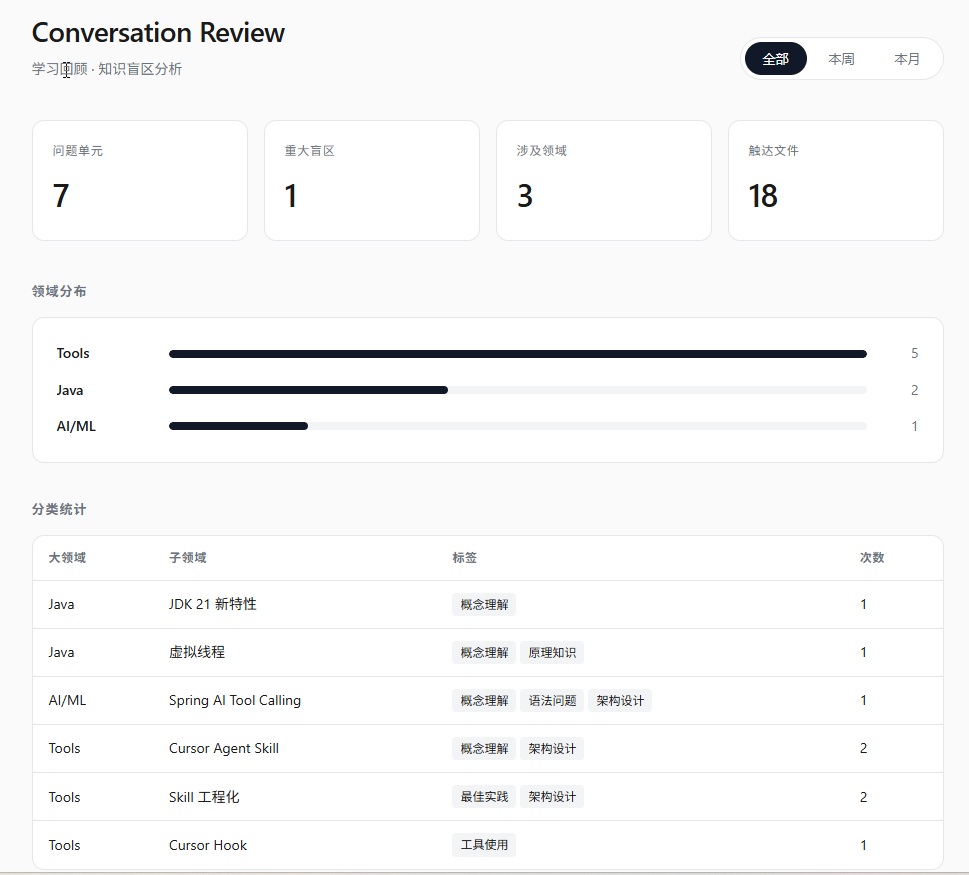
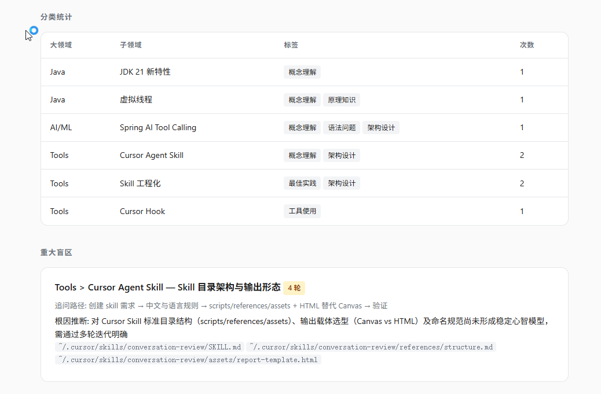

# Conversation Review

**Conversation Review** 是一个 Skill，用于回顾**当前对话框**中的对话，把零散提问沉淀为可复盘的知识结构。
- 提取用户问题、做二级分类与打标签、识别多轮追问盲区、映射触达源码，并输出 Markdown 报告、HTML 可视化报告、Anki 闪卡与可执行行动项。
  适合在一段Vibe Coding或这知识问答后使用。
## 效果

运行 Skill 后，会生成 HTML 报告，可在浏览器中查看统计、分类与盲区分析：



报告还会深入拆解**重大盲区**——追问路径、根因推断，以及建议 revisit 的源码文件：



同一次回顾还会附带聊天内的 Markdown 摘要、Anki CSV 闪卡，以及可在一次 sitting 内完成的行动项清单。

## 快速使用

### 1. 安装 Skill

将本仓库中的 `conversation-review` 目录复制到 Cursor 用户级 Skill 目录：

```powershell
# Windows（PowerShell）
Copy-Item -Recurse -Force conversation-review "$env:USERPROFILE\.cursor\skills\conversation-review"
```

```bash
# macOS / Linux
cp -r conversation-review ~/.cursor/skills/conversation-review
```

### 2. 在对话中触发

在任意 Cursor 聊天中，用自然语言或斜杠命令即可调用，例如：

- `/conversation-review`
- 「帮我做对话回顾 / 学习复盘」
- 「分析一下这次对话的知识盲区」

Skill 会分析**当前对话框**（不跨会话），输出语言与你在对话中使用的主要语言保持一致。

### 3. 查看 HTML 报告

Agent 生成报告后，会在聊天中给出 HTML 文件的完整路径。用浏览器打开即可；报告支持**全部 / 本周 / 本月**时间范围切换，多次回顾会累积到本地 datastore（默认 `~/.cursor/skills/conversation-review/data/reviews.json`）。

### 4. （可选）会话结束自动触发

若希望每次对话结束时自动发起回顾，可参考 [`conversation-review/references/hook-setup.md`](conversation-review/references/hook-setup.md) 配置 Cursor Hook。

---

更多细节见 [`conversation-review/SKILL.md`](conversation-review/SKILL.md)。
