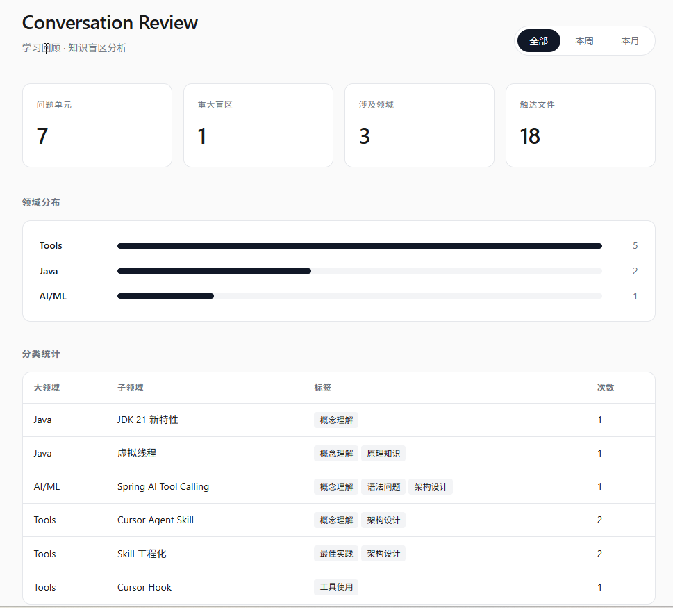
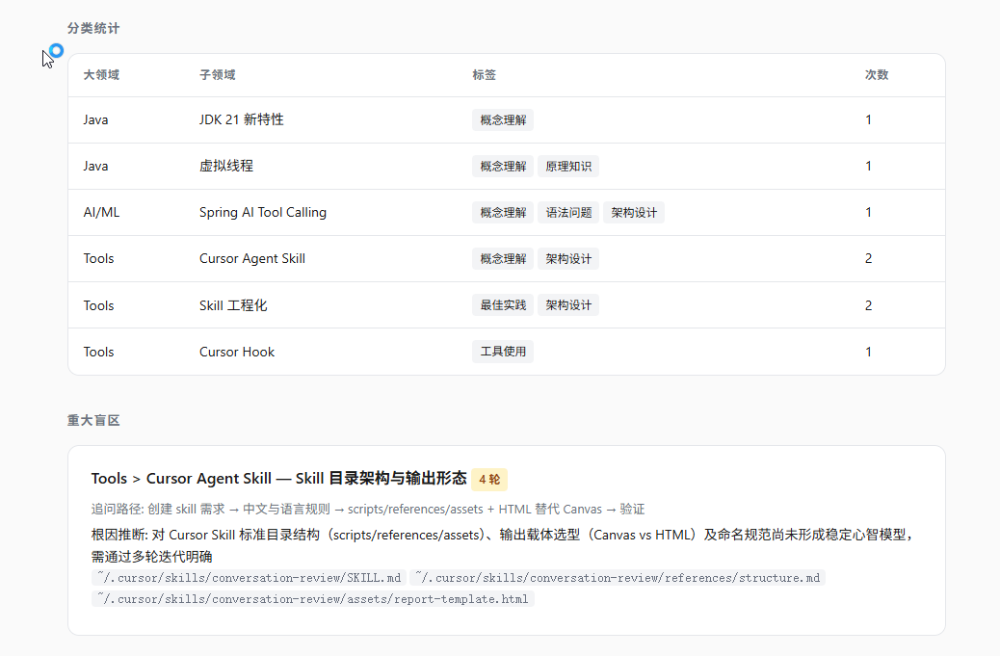

# Conversation Review

**Conversation Review** 是一个 Skill，用于回顾**当前对话框**中的对话，把零散提问沉淀为可复盘的知识结构。
- 提取用户问题、做二级分类与打标签、识别多轮追问盲区、映射触达源码，并输出 Markdown 报告、HTML 可视化报告、Anki 闪卡与可执行行动项。
  适合在一段 Vibe Coding 或知识问答后使用。

## Skills 企业应用：痛点与解决方案

团队在 Cursor 等 AI 编程助手上规模化协作时，常见瓶颈不在「会不会用模型」，而在**知识如何流转、经验如何复用、盲区如何被看见**。Skills 是把组织方法论写成可分发、可版本化、可触发的工作流；Conversation Review 则补上「会话结束后的沉淀」这一环。

| 企业痛点 | 表现 | Skills 通用解法 | Conversation Review 的对应能力 |
|----------|------|-----------------|----------------------------------|
| **经验难沉淀** | 问完即走，个人聊天记录无法检索、无法复用 | 将 SOP、规范、检查清单固化为 Skill，全员共享同一套 `SKILL.md` | 自动提取问题单元、分类统计、HTML 报告持久化到本地 datastore，支持按周/月回看 |
| **协作不一致** | 每人 prompt 风格不同，输出质量参差 | Skill 约束流程、输出格式与引用规范，降低对个人「提示词功底」的依赖 | 固定 10 步工作流与 JSON Schema，报告结构、Anki 格式、行动项粒度一致 |
| **培训盲区不可见** | 主管不知道成员卡在哪，只能等线上事故 | 领域 Skill 编码「应该怎么问、怎么审」；Hook 在关键节点自动注入检查 | 识别多轮追问盲区（长线程、换说法重复、深度升级），输出追问路径与根因推断 |
| **新人上手慢** | 隐性知识在老人脑子里，文档滞后于代码 | 按仓库/技术栈维护 Skills 库，新人安装即获得上下文 | 映射对话中触达的源码文件，标注建议 revisit 的路径，缩短「从提问到定位代码」的距离 |
| **学习无闭环** | 培训做完就忘，复盘停留在口头 | Skill + Hook 把「事后动作」自动化（生成报告、跑脚本、开 PR） | 生成 Anki 闪卡与可在一个 sitting 内完成的行动项，把盲区变成可复习、可执行的任务 |
| **治理与审计弱** | 难以回答「团队最近在学什么、反复踩什么坑」 | Skills 进 Git 评审；团队级规则与项目级规则分层 | 分类表（大领域 / 子领域 / 标签）+ 时间筛选，便于汇总周/月学习主题与高频盲区（可扩展接入团队 datastore） |

**落地建议（团队级）：**

1. **Skills 库进仓库** — 与代码同级做 PR 评审，避免「个人私藏 prompt」。
2. **项目 Skill + 用户 Skill 分层** — 项目内放领域规范（如 API、安全）；用户级放通用复盘类 Skill（如本仓库）。
3. **Hook 降低触发成本** — 会话结束自动发起回顾，见 [`hook-setup.md`](conversation-review/references/hook-setup.md)。
4. **定期看 HTML 报告** — 用「重大盲区」驱动内部分享、文档补齐或专项培训，而不是只堆聊天记录。

## 效果

运行 Skill 后，会生成 HTML 报告，可在浏览器中查看统计、分类与盲区分析：



报告还会深入拆解**重大盲区**——追问路径、根因推断，以及建议 revisit 的源码文件：



同一次回顾还会附带聊天内的 Markdown 摘要、Anki CSV 闪卡，以及可在一次 sitting 内完成的行动项清单。

## 快速使用

### 1. 安装 Skill

将本仓库中的 `conversation-review` 目录复制到 Cursor 用户级 Skill 目录：

```powershell
# Windows（PowerShell）
Copy-Item -Recurse -Force conversation-review "$env:USERPROFILE\.cursor\skills\conversation-review"
```

```bash
# macOS / Linux
cp -r conversation-review ~/.cursor/skills/conversation-review
```

### 2. 在对话中触发

在任意 Cursor 聊天中，用自然语言或斜杠命令即可调用，例如：

- `/conversation-review`
- 「帮我做对话回顾 / 学习复盘」
- 「分析一下这次对话的知识盲区」

Skill 会分析**当前对话框**（不跨会话），输出语言与你在对话中使用的主要语言保持一致。

### 3. 查看 HTML 报告

Agent 生成报告后，会在聊天中给出 HTML 文件的完整路径。用浏览器打开即可；待办项数据与 HTML 报告保存在**当前项目工作目录**下：

- `data/todos.json` — 待办项累积数据
- `data/conversation-review.html` — 可视化报告

### 4. （可选）会话结束自动触发

若希望每次对话结束时自动发起回顾，可参考 [`conversation-review/references/hook-setup.md`](conversation-review/references/hook-setup.md) 配置 Cursor Hook。

---

更多细节见 [`conversation-review/SKILL.md`](conversation-review/SKILL.md)。
